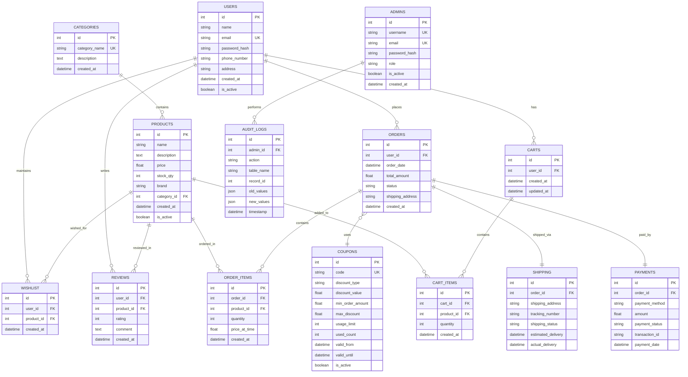

# E-Commerce Platform ER Diagram (Mermaid)

## Entity Descriptions

### Core Business Entities

**USERS**: Customer accounts with authentication and profile information
- Unique email constraint for login
- Soft delete capability with is_active flag
- Tracks creation timestamp

**CATEGORIES**: Product classification system
- Hierarchical organization of products
- Unique category names to prevent duplicates

**PRODUCTS**: Catalog items available for purchase
- Links to categories for organization
- Stock quantity tracking for inventory management
- Price and brand information
- Soft delete with is_active flag

### Shopping Cart System

**CARTS**: User shopping baskets
- One cart per user (1:1 relationship)
- Tracks creation and last update timestamps

**CART_ITEMS**: Individual items in shopping carts
- Links products to carts with quantities
- Allows multiple quantities of same product

### Order Management

**ORDERS**: Customer purchase records
- Links to user who placed the order
- Tracks total amount and order status
- Includes shipping address for delivery

**ORDER_ITEMS**: Individual products within orders
- Preserves product price at time of purchase
- Tracks quantity ordered

### Payment & Shipping

**PAYMENTS**: Transaction records
- One-to-one with orders
- Tracks payment method and status
- Includes transaction IDs for reconciliation

**SHIPPING**: Delivery information
- One-to-one with orders
- Tracks shipping status and delivery dates
- Includes tracking numbers

### User Experience

**REVIEWS**: Customer feedback on products
- Links users to products with ratings and comments
- Enables product quality tracking

**WISHLIST**: User's saved products
- Many-to-many relationship between users and products
- Allows users to save products for later purchase

### Administrative Features

**ADMINS**: Administrative user accounts
- Separate from customer accounts
- Role-based access control
- Audit trail for administrative actions

**COUPONS**: Discount and promotion system
- Unique coupon codes
- Flexible discount types (percentage or fixed amount)
- Usage limits and validity periods

**AUDIT_LOGS**: Administrative action tracking
- Records all changes made by administrators
- JSON storage for flexible data capture
- Timestamp tracking for compliance

## Key Design Features

1. **Referential Integrity**: All foreign key relationships maintain data consistency
2. **Audit Trail**: Complete tracking of administrative changes
3. **Soft Deletes**: is_active flags preserve data while hiding inactive records
4. **Flexible Pricing**: Order items store price at time of purchase
5. **Scalable Design**: Normalized structure supports growth
6. **User Experience**: Wishlist and review systems enhance customer engagement
